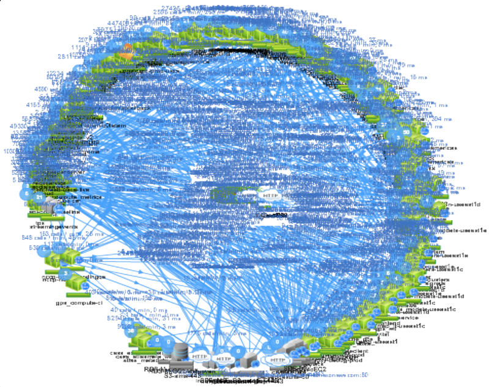

# Entwurf
#### by Simon Peter

---

## Inhalt

* Was ist ein Software Entwurf?
* Entwicklungsrichtung
* Aspekte des Architekturentwufs
* Architekturmuster/Standardarchitektur

---

Komplexe Software ist frustrierend!


----

## Für was ist der Software Entwurf?

* Karte
* Vereinfachung durch Strukturen
* Wiederverwendbarkeit
* Kommunikation

---

## Was ist ein Software Entwurf?

* Ziele
  1. Gliederung des Systems in handhabbare Einheiten
  1. Festlegung der Lösungsstruktur
  1. Hierarchische Gliederung
* Die Tätigkeit Charakteristiken eines Systems oder einer Komponente zu definieren.
* Resultat: Architektur
* Architektur- vs. Softwareentwurf

---

## Entwicklungsrichtung

* <em>top-down</em><br>
  Üblicher Ansatz
* <em>bottom-up</em><br>
  Spezielle Anforderungen bei Implementierung
* <em>outside-in</em><br>
  Festgelegte Schnittstelle
* <em>inside-out</em><br>
  Funktionserweiterung bestehender Systeme

---

## Aspekte des Architekturentwurfs

* Modularisierung
* Kopplung und Zusammenhalt
* Information Hiding
* Trennung von Zuständigkeiten
* Hierarchische Gliederung
* Agilität

----

### Modularisierung

* Ziele
  * Jedes Modulen einfach
  * Implementierung austauschbar
  * Änderungen ohne Modifikation von Schnittstellen

----

### Kopplung und Zusammenhalt

* Geringe Kopplung
* Hoher Zusammenhalt
* Bessere Wartbarkeit, Verständlicher Code

----

### Information Hiding

* Need to know
* Weniger Missbrauch
* Kontrolliertes Datenhandling

Amazon - Jeff Bezos around 2002
* All teams will henceforth expose their data and functionality through service interfaces.
* Teams must communicate with each other through these interfaces.

> Anyone who doesn't do this will be fired.

----

### Trennung von Zuständigkeiten

----

### Agilität

* Änderung der Architektur

---

## Architekturmuster

* Schichtenarchitektur
* Pipes und Filter
* Model-View-Controller
* Microservices

----

### Schichtenarchitektur

* Leicht verständlich
* Lose Kopplung
* protokollbasierte Schichten
* objektorientierte Schichten

----

### Pipes und Filter

```bash
ls -al | grep important | awk '{print $2}'
```

* Datenfliessband Verarbeitung
* Datenformat
* Fehlerfall

----

### Model-View-Controller

* Grafische- und Webanwendungen
* Beliebte Frameworks - Spring, Django

----


----

### Microservices

* Vom Monolith zu Microservices
* Verteilt
* Overengineering Small Apps
* Skalieren in Wirklichkeit

----



---


---


## Quellen

Software Engineering, Jochen Ludewig - Horst Lichter
https://plus.google.com/+RipRowan/posts/eVeouesvaVX
http://www.slideshare.net/atseitlin/resiliency-through-failure-oscon-2013-24727731
https://en.wikipedia.org/wiki/Model%E2%80%93view%E2%80%93controller
